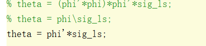
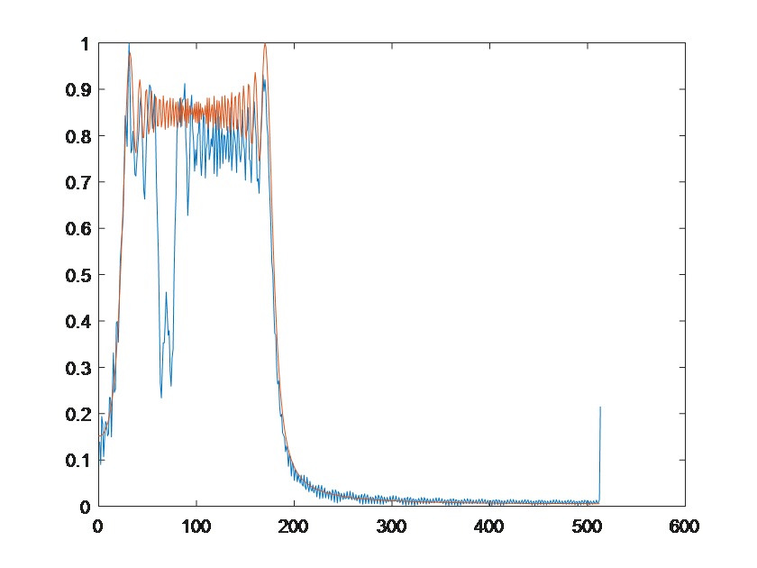
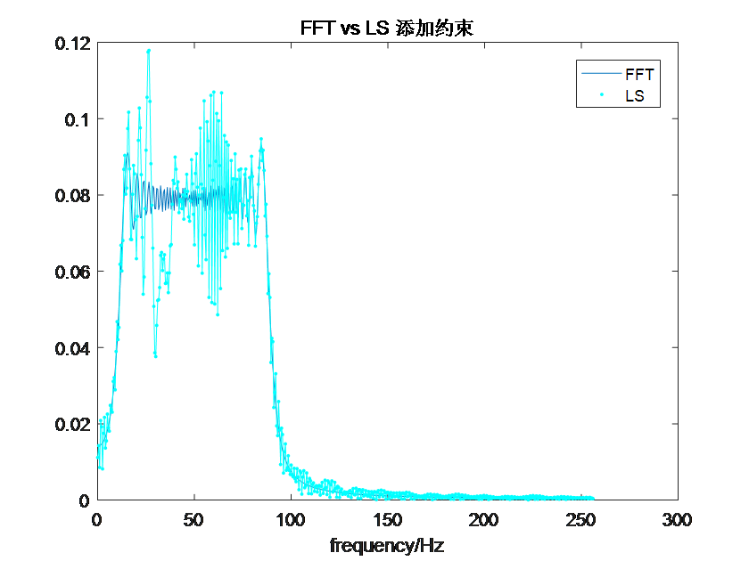
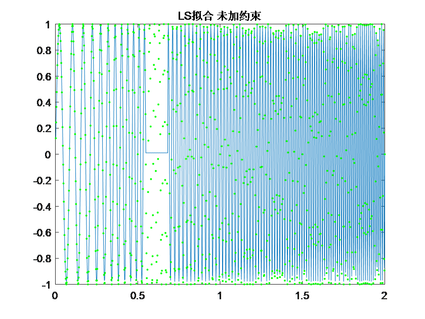

20190106

实验背景：在实现均匀采样的FFT和LS对比实验，且验证LS可以取得很好的效果后，我们开展对有数据缺失的信号进行频谱分析。

信号：$$
sig=sin\left( 2\pi \left( 20t^2+10t \right) \right) ​$$缺失区间 ：\[ 280 350 \]

在没有约束的条件下，用**复指数函数**产生最小二乘法的基函数矩阵，但求解频谱系数时，没有按照最小二乘法的推导结果公式： 而是采取直接矩阵相乘 求相关系数的方法，可以得到和学长程序中运用帕斯瓦尔能量约束接近效果（此时我们的方法还没有加任何约束条件）。实验结果及对比结果如下：

未添加任何约束：

学长的添加能量约束：

我们的重构信号：
