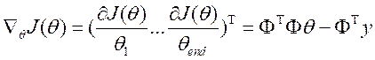
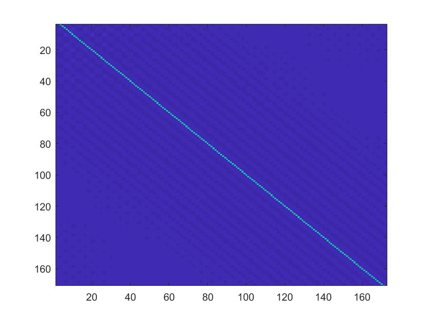
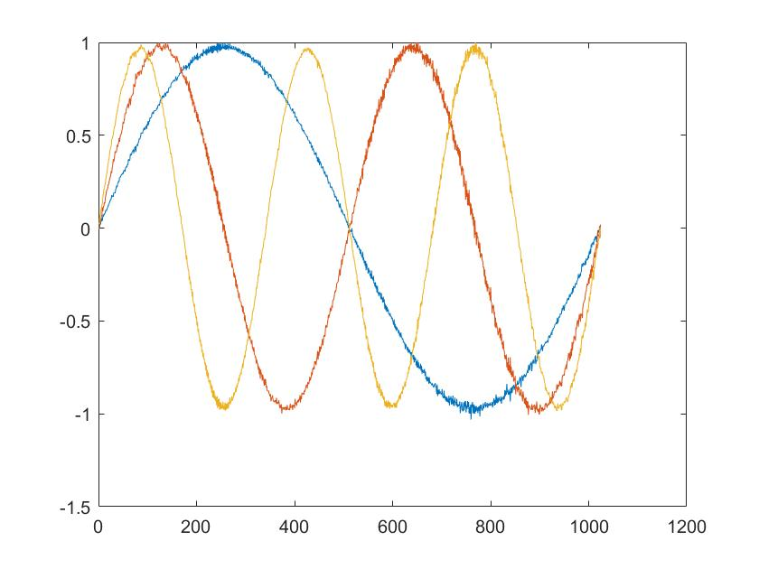
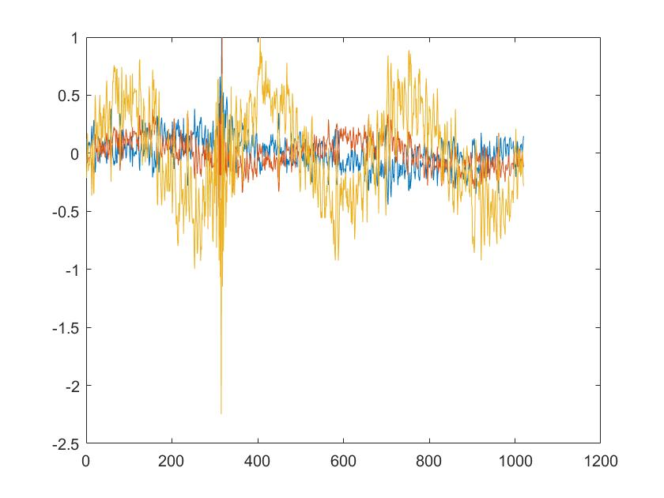
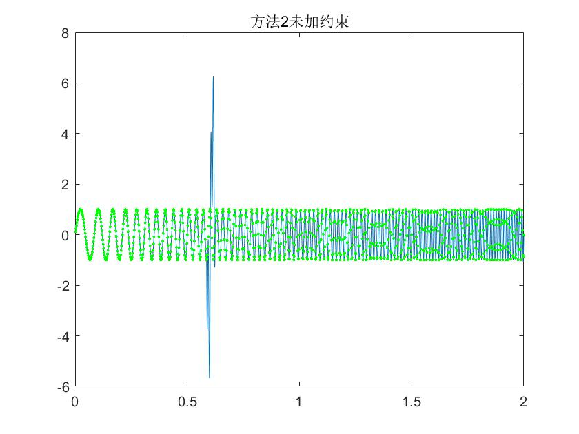
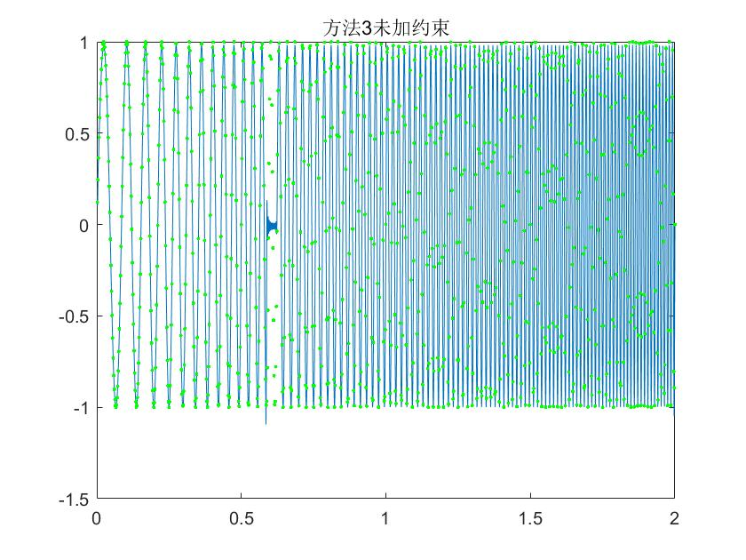
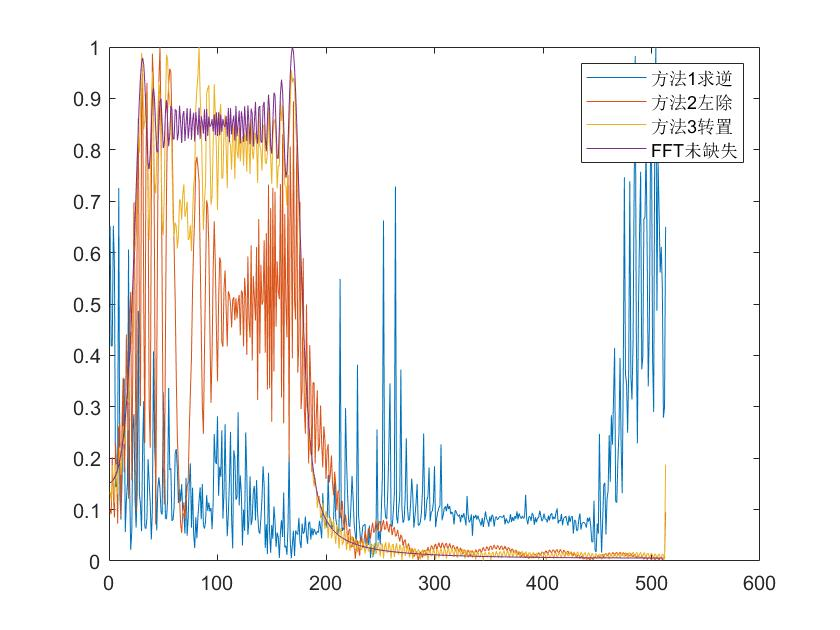
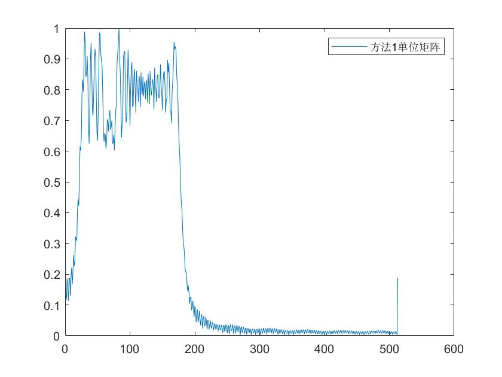
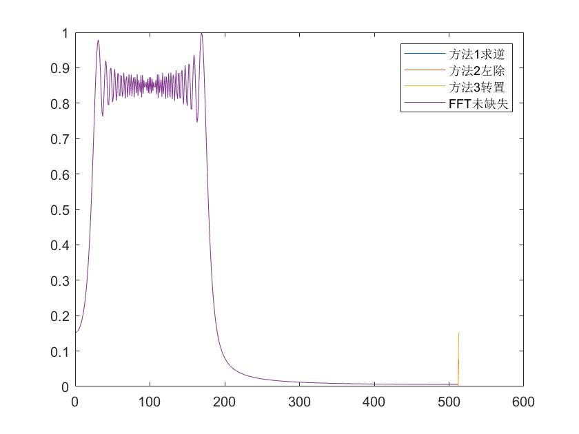

## 最小二乘法不同求解对比

为了用基函数拟合目标信号$$y$$，需要找到一组合适的系数$
\theta $
$$
\varPhi \theta =y
$$

其中$\varPhi$ 为基函数拼成的矩阵，其意义是将目标信号用这组基来表示，并使得均方意义下的误差最小。误差函数定义为：


对$$
J\left( \theta \right) 
$$中所有参数求偏微分：



使偏导为零，便获得：


当$\varPhi$的逆存在时，得到参数的$\theta​$估计：


由于信号在某个区间内缺失，导致$\varPhi$在MATLAB中不为方阵，因此不能直接对$\varPhi$求逆，因此在MATLAB中有下面三种求解最小二乘法的方法

- **方法1：最小二乘法原始公式**

  ```matlab
  theta1 = inv(phi'*phi)*phi'*sig_ls
  ```

  这种求解方法直接带入最小二乘法的求解公式在MATLAB中执行这条指令会出现如下警告

  ```matlab
  警告: 矩阵接近奇异值，或者缩放错误。结果可能不准确。RCOND =  4.499649e-42。
  ```

   其原因在于公式中矩阵
  $$
  temp1 = \left( \varPhi ^T\varPhi \right)
  $$
  不为满秩矩阵，因此求逆时会出现问题。由于基函数拼接的矩阵$\varPhi​$每个基函数之间具有正交性，矩阵$temp​$结果近似为对角矩阵，即在对角线上有极大的值且这些值几乎相等，而在其他位置的值几乎为0，利用MATLAB将$temp​$矩阵可视化如下

  

   对$temp$矩阵归一化后可以近似为单位矩阵$I$，也就是说最小二乘法的表达式在MATLAB进行计算时可以化简为
  $$
  \hat{\theta}=\left( \varPhi ^T\varPhi \right) ^{-1}\varPhi ^Ty
  \\
  \approx k\cdot I\varPhi ^Ty
  \\
  \approx k\cdot \varPhi ^Ty
  $$
  方法3将采用上面化简的公式计算

  另外对最小二乘法求解公式中与$y​$相乘的左部分
  $$
  temp2=\left( \varPhi ^T\varPhi \right) ^{-1}\varPhi ^T
  $$
  进行分析，发现如下特点

  - 在数据未缺失时，temp2为基函数组成的矩阵，但有少量噪声

    

  - 在数据缺失时，也可以看出temp2为基函数组成的矩阵，但有大量噪声(下图为缺失5个点，缺失区间[315 320])

    

    原因初步分析为求$(\varPhi ^T\varPhi ) ^{-1}$时，括号中间矩阵非满秩，MATLAB计算出现警告导致。因此，在方法3中，直接用基函数矩阵$\varPhi ^T$的转置来代替$temp2=\left( \varPhi ^T\varPhi \right) ^{-1}\varPhi ^T$

- **方法2：直接左除法**

  ```matlab
  theta2 = phi\sig_ls;
  ```

  这是以往程序在MATLAB中求解最小二乘法的计算式，这种方法不会报错，但是效果与方法3相比并不理想，其原因估计还是在于MATLAB求逆的误差。在重构信号中信号会出现过拟合问题，表现为缺失部分重构出的信号幅度起伏很大

  

- #### **方法3:基函数转置法**

  ```matlab
  theta2 = phi'*sig_ls;
  ```

  在方法1中推导最小二乘法近似表达式，使用这个方法出现的情况是重构信号在缺失区域几乎为0

  在原理上这种方法相当于把信号缺失的区域强度设为0，然后进行FFT变换。

  #### **效果对比**

- 在数据缺失的情况下(缺失区间[300 320])

  

若把方法1中$temp1 = \left( \varPhi ^T\varPhi \right)$换为单位矩阵$I​$，计算结果与方法3，基函数转置法的结果相同
$$
\hat{\theta}=\left( \varPhi ^T\varPhi \right) ^{-1}\varPhi ^Ty
\\
\approx k\cdot I\varPhi ^Ty
\\
\approx k\cdot \varPhi ^Ty
$$




- 在数据不缺失的情况下

  

所有方法效果相同，直流分量部分有差异

**分析：**观察上图可以看到，方法1由于求矩阵的逆出现警告错误效果较差，方法2过拟合问题估计是由于MATLAB左除精度问题导致。在频域中方法3表现效果较好，没有出现过拟合问题，但是恢复信号在缺失区域几乎为0，这是因为近似后方法3等同于将信号缺失部分置0然后带入FFT进行计算。

**问题：**

1. 延续学长学姐之前的算法出现过拟合的情况，我们认为是由于求解过程中采用MATLAB提示中的左除方式求解产生的。我们对矩阵进行近似后（方法3）试验的重构信号没有出现过拟合，在频域与FFT结果更为接近，但是也无法近似得到信号时域的波形。我们想知道学长学姐在之前的研究中是否采取过其他方法进行求解，以及今后实验是使用左除解决过拟合问题，还是使用近似方法3，我们担心方法3计算较为简单并且与FFT的计算方法十分接近，会不会缺少创新点？
2. 对于方法3，在使用最小二乘法进行缺失信号的分析时，频域的最佳效果是能够接近不缺失时FFT的结果，但是可能在时域出现不理想的恢复结果（例如方法3中缺失部分恢复结果几乎为0），我们目前想的是从时域波形或者能量上上对信号进行约束，但是如果要从波形上进行约束会不会失去与传统方法相比不用拟合方法的优势。
3. 在进行缺失信号（中间缺失一段）信号的实验时，其目的是验证最小二乘法的正确性，还是证明最小二乘法相比对数据进行拟合后，再用傅里叶变换更有优势？

## 附录：代码

代码已单独发送，文件名：FFT_LS.m

```matlab
% %%%%%%%%%%%%%%%%%%%%%%%%%%%%%%%%%%%%%%%%%%%
% 最小二乘替代
% 时间：20180106
% 附属函数脚本：无
% change log：对三种求解方法的分析对比
% (Caution) 
% %%%%%%%%%%%%%%%%%%%%%%%%%%%%%%%%%%%%%%%%%%%
clc;clear
fs = 512;
% 均匀时间
t = 1/fs:1/fs:2;
N = length(t);
sig = sin(2*pi*(20*t'.^2 + 10*t'));
%% 制造缺失区间
jump_op = 300; % [可调] 
jimp_ed = 320; % [可调] 
t_ls = t([1:jump_op,jimp_ed:end]);
sig_ls = sig([1:jump_op,jimp_ed:end]);
N_ls = length(t_ls);
continue_rate = 4/4; % [可调] 
%% 无约束最小二乘数值解
% 问题：直流分量出现在第一行会导致结果出错
% 求矩阵逆时报错并产生不理想的结果，论文中基函数顺序建议调整
freq_range = [fs/N:fs/N:fs/2];
freq_vector = freq_range(1:floor(length(freq_range)*continue_rate));
phi = ones(N_ls, length(freq_vector)*2+1);
for n = 1:length(freq_vector)
    phi(:,2*n-1) = sin(2*pi*freq_vector(n)*t_ls);
    phi(:,2*n) = cos(2*pi*freq_vector(n)*t_ls);
end
% 求解LS方法
% 问题：使用求解方法1，方法3效果和FFT缺失信号置0效果相同，具体表现为恢复信号缺失部分几乎为0
% 方法2是左除，结果与张心亮学长程序相同，出现缺失部分过拟合问题
% phi'*phi的结果是仅有对角线有数值的单位矩阵
temp1 = phi'*phi;
base1 = temp1*phi';
base2 = inv(temp1)*phi';
base2 = base2./max(base2,[],2);
base3 = diag(ones(1,length(t)+1))*phi';
theta1 = base3*sig_ls; 
theta2 = phi\sig_ls;
theta3 = phi'*sig_ls;
%% 重构信号
resample_rete = 100; % [可调] 
t_full = min(t):1/fs/resample_rete:max(t);
freq_range_re = [fs/N/resample_rete:fs/N/resample_rete:fs/2/resample_rete];
phi = zeros(length(freq_vector)*2+1, length(t_full));
for i = 1:length(freq_vector)
    phi(2*i-1,:) = sin(2*pi*freq_vector(i)*t_full);
    phi(2*i, :)  = cos(2*pi*freq_vector(i)*t_full);
end
sig_re1 = phi'*theta1;
sig_re2 = phi'*theta2;
sig_re3 = phi'*theta3;
%% 重构信号与原信号时域对比
figure,plot(t_full, sig_re3/max(sig_re3))
hold on
plot(t,sig,'g.')
hold off
title('方法3未加约束')
%% 重构信号与原信号频域对比
ft = abs(fftshift(fft(sig)));
L1 = zeros(N/2+1,1);
L2 = zeros(N/2+1,1);
L3 = zeros(N/2+1,1);
L1(N/2+1) = theta1(end);
L2(N/2+1) = theta2(end);
L3(N/2+1) = theta3(end);
for n = 1:N/2
    L1(n) = sqrt(theta1(2*n-1)^2 + theta1(2*n)^2);
    L2(n) = sqrt(theta2(2*n-1)^2 + theta2(2*n)^2);
    L3(n) = sqrt(theta3(2*n-1)^2 + theta3(2*n)^2);
end
% 归一化
ft = ft/max(ft);
L1 = L1/max(L1);
L2 = L2/max(L2);
L3 = L3/max(L3);
figure,plot(L1),hold on
plot(L2),hold on
plot(L3),hold on
plot(ft(length(ft)/2+2:length(ft))),hold off
legend('方法1求逆','方法2左除','方法3转置', 'FFT未缺失')
```

